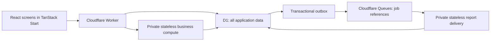

# Pirot Next on Cloudflare

This repository contains the standalone Cloudflare application. The original Spring application remains in a separate repository as a behavioral reference and rollback deployment. The new application has no Java, PostgreSQL, Redis, or external SMTP runtime dependency.

## Runtime and ownership

TanStack Start provides the Vite build, document, and Workers entry point. Each business, account, administration, and report screen has a native TanStack file route. TanStack Router owns navigation, path parameters, history, and query strings; a small presentation adapter preserves the existing screen interfaces. React Router is removed from the application dependencies. The existing React screens, Redux state, and Turkish/English translations preserve cooperative workflows. Authenticated screens render on the client within a persistent application layout; the document renders on the server. Authenticated `/api` requests go directly to the new TypeScript services in the Worker.



D1 is the sole persistent application store: identities, accounts and password hashes, tenant data, sales, stock, cash, debts, shifts, corrections, history, idempotency, pending jobs, report metadata and file bytes. Runtime secrets remain in secret management. The `DIRECTORY` binding and existing database name are retained for compatibility; the database now contains business data too.

All 16 established entity types have ordinary tenant-scoped SQL tables, including `satis`, `urun`, `stok_girisi`, and `kasa_hareketleri`. Composite primary keys are `(tenant_id,id)`. The canonical `data` JSON preserves exact decimal strings and existing DTO contracts; generated columns expose business fields and relation IDs for ordinary SQL queries. `business_entities` is a union view used by shared services. Technical tables use the `business_` prefix. Generated report files use `report_files` and ordered SQLite BLOB rows in `report_file_chunks`.

Every authenticated request verifies the signed JWT, reloads the active account from D1, and checks session version and tenant. Changing password, authority, activation state, or tenant invalidates old sessions. Browser tenant/user fields cannot choose cooperative ownership. Global account/tenant administration and explicit migration endpoints remain deliberate administrator exceptions.

The Worker selects private business compute from the authenticated tenant and overwrites the principal header. The object has no application storage in D1 mode. Existing synchronous business services plan a command through a typed SQL adapter: missing reads are resolved from tenant-scoped D1 queries and planning restarts with stable timestamps and identifiers. Writes remain buffered until validation succeeds. Reads see buffered changes. Unsupported SQL fails explicitly.

Each command commits all stock, cash, debt, primary records, audit, outbox and idempotency effects in one D1 batch. A per-tenant revision is compared and incremented first. A checked guard containing the preceding statement's `changes()` result aborts the entire batch when another command won the revision. Conflicts retry the complete plan with fresh reads. A thrown validation error discards the plan; a late database failure rolls back the entire batch. Read-only plans also recheck the revision. Correctness does not depend on object serialization or a distributed transaction. Tests force competing revisions against actual D1 and verify rollback after a late tenant constraint failure.

The Free plan allows 50 D1 queries per Worker invocation, so the query count of a command is part of its correctness. Three rules keep a command's cost independent of the size of the data it touches. A read that is satisfied from the buffered write set never reaches D1, and a primary-key read is fetched at most once per command from a cache keyed on the physical row, so the growing write set cannot invalidate a row that was already loaded. Relation resolution collects every referenced id before fetching anything, so each related kind costs one query instead of one per row. Writes that cannot change an outcome are skipped: a whole-row entity overwrite reads nothing first, a delete pinned to the full primary key needs only that key, and an audit id is allocated from one cached maximum plus the rows buffered locally. `tests/read-budget.test.ts` asserts the counts against real D1, and asserts that a twenty line sale does not cost materially more than a two line one, which is what catches a per-row read returning.

The committed statements are grouped per target table, but a group is closed when its own binding
budget is spent rather than when any group's is. That distinction is the difference between a hundred
line sale costing 47 of the plan's 50 and costing 54: closing every open group whenever the widest
table ran out re-split the others into fragments, which is the per-row pattern the grouping exists to
remove. The read side is flat in the width of the sale; the statement side is not, because each line
writes a line row, a stock row and two audit rows, and audit rows are eight bindings wide. A
hundred-line sale measures 47 of 50 reads and statements together, and the suite asserts it.

A single statement cannot bind more than 100 parameters, so a relation read that spans more ids than that has to be split. The tenant rewrite binds one parameter per chunk of buffered JSON ahead of the caller's own, which makes the widest safe list a function of what the operation has already buffered. That count is read from the adapter (`TenantSql.deltaBindings`) rather than reserved as a fixed allowance: a guess that forgets either the row kind or a second buffered chunk fails an ordinary large sale with `too many SQL variables`, and the width that triggers it is reached by a normal cooperative. `tests/binding-budget.test.ts` covers the accounting, and `tests/read-budget.test.ts` covers a sale wider than one statement can bind.

Four administration screens — configuration, documentation, logs and metrics — were removed because no
server-side target was ever implemented for them, so every one of them failed to load rather than
showing anything. Their routes, orphaned locale files and the Swagger UI asset and its menu entry went
with them; that last one was working, so it is called out here rather than left to be discovered.
Nothing else in the application referenced them.

BCrypt and report compression use separate private stateless compute objects to preserve legacy hashes and fit the Free edge Worker CPU allowance. These objects store no application data. Moving away from Cloudflare requires replacing compute/binding adapters; persistent data can be recovered from one D1 SQL export.

## Preserved workflows

The TypeScript services cover all 16 established business entity types, sale lines, cash/card/deferred sale creation, collection through sale or debt screens, paid-sale changes, stock entry/waste/return effects, expenses, transfers, price calculation/invoice receipt, producer balances, shift opening/closing, closed-shift corrections, read-back, and the existing reports.

HTTP bodies are bounded to two million streamed UTF-8 bytes before JSON parsing, including public authentication. Migration batches count encoded bytes to stay within that limit.

Checkout previews, discount preservation, cash/change suggestions, and stock displays retain exact decimal strings as well. Integer quantity controls clamp only their input limit to JavaScript’s safe integer range.

The server ignores requested sale totals, paid flags, and ownership and recalculates from persisted products. Quantities are positive safe integers; gram prices are normalized per kilogram and totals use quarter rounding. The maximum discount a sale may carry is the cooperative's own `maxDiscountPercent` setting, which an administrator changes in **Administration → Cloudflare operations**; an absent setting means zero, so the rule can only ever narrow what a cooperative may do. This replaces an earlier rule that keyed the discount allowance to one hardcoded tenant id, and `migrations/0005_seed_discount_ceiling.sql` carries that allowance forward: the cooperative that could discount keeps the 100% it had, and every other cooperative is left at the zero fallback it was already restricted to. The seeded id appears only in that migration, as the historical fact it is. Deferred mode cannot change after creation. Cash collection changes cash once; bank/card collection does not. Editing or deleting compensates the old stock/cash/debt effect. Sale-linked debts cannot be independently edited or deleted.

Closed shifts retain their persisted breakdown. Changes to closed sales, expenses, or transfers require a reason, current active shift, and an immediate or deferred cash choice. Pending correction cash must be settled before another correction. Cancellation preserves historical records. Historical returns retain the legacy restriction on changing quantity/product/type and deleting a refund whose original amount was not recorded.

Decimal values are persisted and transmitted as strings. Input forms retain their text amounts, and persisted-money formatting avoids converting large values through JavaScript numbers. Checkout and price-calculator previews are advisory; services recalculate authoritative amounts. Existing historical member assignment and invoice-report rounding are retained.

## Background delivery

Business/email/report intents enter a transactional outbox. Production and staging bind `JOBS` to Cloudflare Queues. Queue messages contain an outbox reference, keeping large reports and personal data out of the message payload. The consumer forwards the small pointer to a private, stateless SQLite Durable Object, which reads the persisted job, renders XLSX files, stores their metadata and BLOB chunks in D1, sends configured email, and marks the job delivered after successful delivery. Report compression runs under the object CPU allowance rather than the Free queue Worker budget. Failed jobs remain visible and are retryable; queue exhaustion goes to the environment's dead-letter queue. A cron scan requeues unfinished jobs after ten minutes; it runs every fifteen minutes, which is the coarsest interval that still satisfies that ten-minute window, at the cost of up to fifteen minutes of delivery latency for a queued job. The same scan prunes expired tenant rows: idempotency keys after one day, and delivered outbox rows after seven days. A pruning pass is two statements and bounds itself with a rowid subquery, so it costs the same for one cooperative as for a hundred and works a backlog down over successive ticks rather than in one unbounded delete; both age columns are indexed, since the prune is the only consumer and runs on every tick. Pending jobs are never pruned, and `history` is the financial audit trail, so it is retained in full and indexed by time for export rather than deleted. Queue and email delivery are at least once; email can be duplicated if the provider accepts it before an acknowledgment fails. Financial effects never run in a queue.

D1 report keys start with the authenticated tenant. Reports are downloaded through an authenticated endpoint, not a public bucket URL. Month-end reports snapshot current active stock, run in Istanbul time, and use a monthly idempotency key. A cooperative administrator configures its own report recipient and enables the schedule in **Administration → Cloudflare operations**. The report is attached to email when its XLSX is under 3.5 MB; larger reports use an authenticated report-page link to respect email-message limits. Low-stock notifications use the persisted responsible user's email. Invitation and reset emails use Cloudflare Email Service.

Cloudflare Email Sending is currently a beta feature. Verify its availability for the target account, onboard and verify the sender domain, and configure recipient permissions before enabling mail. The core application targets Workers Free, including SQLite Durable Objects, D1 and Queues within their Free quotas. No custom CPU allowance is configured. Sending transactional email to arbitrary recipients requires Workers Paid and an onboarded sender domain; enabling that feature is a separate account decision. Email is off by default outside development. To enable it later, onboard the sender, set `EMAIL_ENABLED=true`, and configure the environment’s `send_email` binding before deployment.

## Local development and verification

Use Node 24.18+ and Bun 1.4.2. Exact versions and the locked graph live in the app's `package.json` and `bun.lock`.

```bash
bun install --frozen-lockfile
bun run local:setup
bun run dev
# A second terminal:
bun run local:seed
```

Setup creates ignored local secrets and applies D1 migrations with `--local`. Seed refuses non-localhost URLs and uses synthetic data only. Default credentials are `developer` / `Synthetic-local-password-42`; set `PIROT_DEV_PASSWORD` to change the local fixture password. The browser suite reads the same variable, so it keeps working with an override. `.dev.vars` is never deployed. Staging/production disable bootstrap.

```bash
bun run lint
bun run format:check
bun run typecheck
bun run test
bun run build
bun run test:migration    # Docker; isolated PostgreSQL 18.4 with synthetic records
bunx --no-install playwright install chromium
bun run test:browser
bun audit --audit-level=high
```

Tests run actual Workerd/Miniflare stateless compute objects, D1, and Queues. They include a synthetic email-provider outage, real queue retries and delivery acknowledgments, a 5,000-product attached XLSX, tenant boundaries, transaction rollback, concurrent stock availability, request retries, financial compensation, correction settlement, exact decimal amounts, account sessions/resets, invoice receipt, report files, and staged import publication. Browser journeys exercise the reused UI and API together. The browser workflow suite creates its own synthetic cooperative, tenant 2, products, and users per test under `tests/browser`. Browser runs own port 9071 and reset only `.wrangler/e2e`; ordinary local D1 and remote resources remain separate. Closed correction history is retained within the disposable fixture rather than deleted. CI runs these checks in this standalone repository. No tests connect to production.

## Provisioning and deployment

The checked-in `wrangler.jsonc` staging bindings refer to the existing Pirot staging resources. Production uses placeholder D1 IDs and URLs. Configure your own environment resources before provisioning a separate deployment. Deployment refuses placeholders and requires an `AUTH_SECRET` for the selected environment. Staging and production use separate Worker names, object namespaces, D1 databases, queues, and dead-letter queues. Local development uses simulated bindings and direct outbox delivery instead of a queue.

After signing into the intended account and selecting the application URL:

```bash
bunx --no-install wrangler login
bun run provision staging https://staging.your-domain.example
bunx --no-install wrangler secret put AUTH_SECRET --env staging
bun run deploy:staging
```

For a new empty staging directory, run `bun run staging:prepare-admin /private/output-directory`. This checks that staging has no users or tenants, then writes a random administrator password and initial identity SQL in private files outside the repository. Apply that SQL only to `pirot-directory-staging` with `wrangler d1 execute pirot-directory-staging --remote --env staging --file /private/output-directory/staging-admin.sql`. It refuses preparation for a populated directory and never enables an HTTP bootstrap endpoint. Use the credential file to sign in and change the initial password. Production identities are imported through the reviewed migration below.

Generate a fresh random signing secret with at least 32 characters using a password manager or secret generator. Enter it at the Wrangler prompt; do not commit it, put it in command history, or reuse the legacy production key. If enabling outbound email later, onboard the sender domain in Cloudflare Email Service and supply it as the optional third provisioning argument. Point the selected domain at the Worker through Cloudflare, and confirm `PUBLIC_URL` matches it for account links. The provisioning script creates only the environment's named D1/queue resources, writes binding IDs, and applies D1 migrations remotely. It never imports existing data or moves DNS automatically.

Deploying production requires explicit operator authorization and a rehearsed cutover. Then provision `production`, enter its separate signing secret, and run `bun run deploy:production`. The deploy script runs lint, formatting, typecheck, persistence tests, dependency audit, and an environment-specific build before Wrangler. It verifies that the generated Worker name and D1 binding match the selected environment. CI does not automatically deploy either environment. Review the environment configuration and Cloudflare billing before provisioning.

The configured staging URL is `https://pirot-cloudflare-staging.mertmr.workers.dev`. It is an isolated deployment with synthetic verification records and user-entered staging data; no production data or DNS cutover has occurred. Staging HTTP checks cover authentication, tenant isolation, sales and compensation, deferred collection, and Queues-to-D1 report delivery. The Free deployment passed these checks after moving BCrypt to the private password object; an observed administrator login used 8 ms of edge Worker CPU and 363 ms in the password object. These are measurements of the synthetic smoke request, not a guarantee for every workload. The staging deployment deliberately keeps the Free plan and sets `EMAIL_ENABLED=false`. Invitation and reset sending are unavailable; administrators create users with an initial password, and existing signed-in users can change their own password. Reset initiation returns a localized 503 for both known and unknown addresses without writing reset keys. Low-stock email notifications are disabled. Previously persisted email jobs remain in D1 and are paused without repeated queue attempts; enabling email later resumes them. Pending-job counts include dispatchable jobs. Monthly stock reports still run and are stored in D1 for authenticated download without email.

After staging deployment, run `bun run smoke:staging /private/staging-admin.json /private/proof-directory`. The command accepts only the configured staging `workers.dev` address and matching credentials. It creates a separate synthetic cooperative, verifies HTTP authentication and tenant isolation, exercises sale/stock/cash/retry/collection compensation, and waits for a queued D1 XLSX report. It sends no email and never connects to the legacy database. The private verification receipt records reconciliation; synthetic audit records remain in staging.

Operations are in Cloudflare observability and the application's operations/health pages. A failed email configuration does not roll back a completed sale; its outbox job remains pending. All persistent application data now shares D1 backups/Time Travel. Preserve runtime secrets separately and retain an independent SQL export.

## Business backup and recovery

A portable backup copies a cooperative's entities and financial history inside one SQLite transaction, then reads the immutable copy in bounded pages. Writes may continue after capture. The command verifies all entity/history checksums and exact financial balances before publishing a mode-600 file. Temporary database copies are released on completion and expire after 24 hours; at most two may exist per cooperative.

```bash
# Set PIROT_MIGRATION_TOKEN securely to an administrator JWT.
bun run backup:tenant https://staging.your-domain.example 1 /secure/backups/tenant-1-2026-10-01.json
```

The tenant archive is a focused business recovery format: entities, financial history and cooperative report settings. Restore into an empty D1 database with the original tenant/user IDs already restored. The importer refuses overwriting a live cooperative and checks exact balances and history before publication. A Workerd integration test captures pages while later sales continue and restores them into a separate empty D1 database.

For complete recovery or leaving Cloudflare, export the single database to a private directory:

```bash
umask 077
bunx wrangler d1 export pirot-directory-staging --remote --env staging --output /secure/backups/pirot-staging.sql
sqlite3 /secure/backups/restored.sqlite < /secure/backups/pirot-staging.sql
```

This includes accounts, all business tables, history, pending jobs, idempotency records, and report BLOBs. The export has been restored into independent SQLite and compared row for row and byte for byte. Retain the signing secret separately for unchanged sessions; rotate it intentionally when revoking existing sessions. Pending email delivery remains at least once, so reconcile delivery before resuming consumers after recovery.

To inspect a saved sale in the Cloudflare D1 console, choose **pirot-directory-staging**, then query:

```sql
SELECT id, tenant_id, tarih, toplamTutar, kartliSatis, sonraOdeme, odendi
FROM satis WHERE tenant_id = 1 ORDER BY id DESC;
```

The previous staging layout was migrated once, from a temporary Durable Object storage bridge with a legacy R2 binding, into D1: business writes were frozen, all tables and files captured into private backups, imported into empty D1 business tables, compared against a complete D1 export, and the legacy objects then cleared only after a stored verification proof matched unchanged entities and history. That migration preserved the existing staging records and reports. D1 is now the only persistent store: there is no R2 binding, no storage-freeze mode, and no alternate business-storage path in the application.

## Read-only export and resumable migration

Do not use a running production database as a writable fixture. Rehearse from a sanitized/offline export first. During final cutover, stop legacy writes before taking a consistent export; the new deployment must remain unavailable to cooperative users until imports reconcile. Keep the original deployment and database unchanged.

`scripts/export-postgres.sql` uses one repeatable-read **read-only** PostgreSQL transaction. It exports every business table, tenants, accounts/authorities, authentication events, and JaVers snapshots as NDJSON. Numeric values/IDs are explicitly exported as text; UTC matches the legacy Hibernate configuration. Use a read-only database account and a secure directory outside the repository. Provide credentials through approved PostgreSQL secret mechanisms, never command-line literals or committed files.

```bash
psql --no-psqlrc --quiet --tuples-only --no-align \
  --set ON_ERROR_STOP=1 --file scripts/export-postgres.sql \
  --output /secure/path/pirot.ndjson
bun scripts/prepare-migration.ts /secure/path/pirot.ndjson /secure/path/bundles
```

Preparation does not contact either database. It writes mode-600 identity SQL, a raw JaVers archive, and one tenant bundle per cooperative. It preserves BCrypt hashes, IDs, UTC instants, all financial strings, and closed-shift correction data. It fails on unsafe IDs, missing tenant ownership, unknown authorities, invalid identity records, or ambiguous timestamps. JaVers business history is normalized while retaining the raw archive. For deleted historical entities without a tenant field or surviving owner, supply an explicitly reviewed `kind:id → tenantId` mapping as the third argument; preparation never guesses ownership from an author.

Initialize a new empty environment's D1 schema, review and apply `directory.sql`, then sign in as an imported administrator. Legacy JWTs deliberately stop working. Never import identities into a directory that already contains application users.

```bash
bunx --no-install wrangler d1 execute pirot-directory-staging \
  --env staging --remote --file /secure/path/bundles/directory.sql
# Set PIROT_MIGRATION_TOKEN securely in the shell environment, without logging it.
bun scripts/import-tenant.ts /secure/path/bundles/tenant-1.json https://staging.your-domain.example
```

Each import has begin/batch/history/finish/status/abort operations. Begin requires an empty tenant and marks it unavailable. Batches retain existing IDs and use stable idempotency keys, so the same bundle can resume after interruption. Finish verifies tenant relationships, declared field types, shift references, entity counts, SHA-256 checksums of every canonical entity, the history checksum/count, exact stock totals, latest cash balance, sale/deferred totals, and producer balances. A mismatch leaves the tenant unavailable. Only an unpublished import can be aborted; a live tenant cannot be overwritten or cleared. Sequence counters continue above imported IDs.

The reconciliation manifest is defined once, in `src/server/reconciliation-contract.ts`. The build script and the running server both call that module, so the digests they compare cannot drift apart. Audited history fields are listed there too, and the tenant key is deliberately excluded from the history digest.

```bash
# Read-only reconciliation against the prepared bundle:
bun scripts/import-tenant.ts /secure/path/bundles/tenant-1.json https://staging.your-domain.example verify
# Clear only an unpublished import:
bun scripts/import-tenant.ts /secure/path/bundles/tenant-1.json https://staging.your-domain.example abort
```

Successful verification writes a mode-600 receipt beside the bundle. Keep receipts, raw export, identity SQL, and the JaVers archive in encrypted operational storage, outside Git. Before cutover, compare key reports in the legacy and new environments, rehearse sale/edit/delete and shift correction with synthetic accounts, verify configured email delivery and D1 report downloads, and record a restore drill.

If no new financial writes have been accepted, rollback can switch traffic to the unchanged legacy deployment. After new writes, reverting traffic requires a reviewed reverse migration/reconciliation; do not silently resume the stale PostgreSQL state. The new runtime and PostgreSQL exports have been verified with synthetic data. Actual production import, provider email delivery, domain routing, and a production deployment require account/data access and explicit operator authorization.

## References

- [TanStack Start on Cloudflare Workers](https://developers.cloudflare.com/workers/framework-guides/web-apps/tanstack-start/)
- [D1 transaction batches](https://developers.cloudflare.com/d1/worker-api/d1-database/)
- [D1 limits](https://developers.cloudflare.com/d1/platform/limits/)
- [Durable Object platform limits](https://developers.cloudflare.com/durable-objects/platform/limits/)
- [Email Service Workers API and attachments](https://developers.cloudflare.com/email-service/api/send-emails/workers-api/)
- [Email bindings](https://developers.cloudflare.com/email-service/configuration/send-bindings/)
